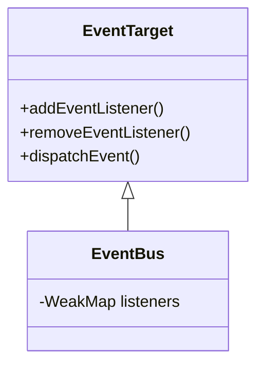

## Getting started

To install the eventbus into your project, simply run

```bash
npm install @yhwh-script/event-bux
```

## EventBus architecture



## How-To

For instance: 

```javascript
<script type="module">
  import * as bus from '@yhwh-script/event-bux';
  window.bus = bus;
</script>
```

After importing `@yhwh-script/event-bux`, it is recommended to add it to the `window` object.

You can use your own import or stick to other `@yhwh-script` examples

Then use `bus.addEventListener(type, listener)` and `bus.dispatchEvent(type, event)` in your WebComponents. You are not bound to event bubbling or capturing (which are the standard event propagation mechanisms), but you can send events even between WebComponents! Check it out!


## Contribute

Welcome!