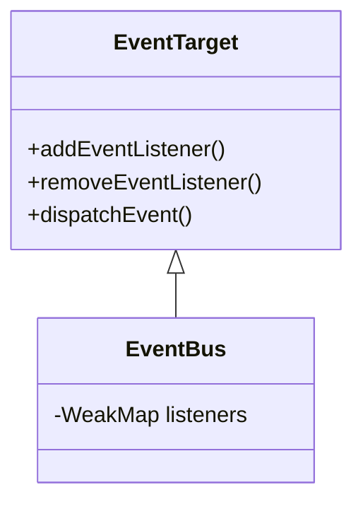

## Getting started

To install the eventbus into your project, simply run

```bash
npm install @yhwh-script/event-bux
```

## EventBus architecture



## How-To

After importing this module in your code, it is recommended to add it to the window object:

```javascript
<script type="module">
  import * as bus from '@yhwh-script/event-bux';
  window.bus = bus;
</script>
```
Then use `bus.addEventListener(type, listener)` and `bus.dispatchEvent(type, event)` to send event between components.