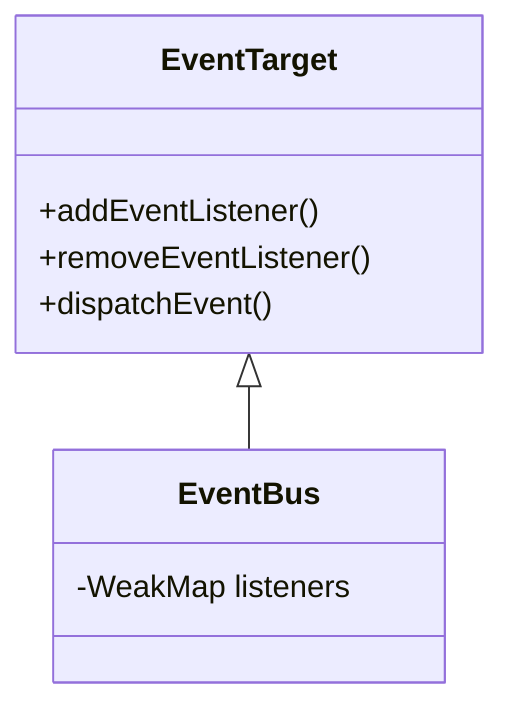

## Getting started

To install EventBux module into your project, simply run

```bash
npm install @yhwh-script/event-bux
```

## EventBus architecture



## Recommendation

After importing this module in your code, it is recommended to add it to the window object, like in `@yhwh-script/components`

```javascript
  Promise.all([
    import('@yhwh-script/event-bux')
  ]).then((importedModules) => {
    importedModules.forEach((module) => {
      if (!module.name) {
        throw new Error('Missing name in imported module.');
      }
      window[module.name] = module;
    });
  }).finally(() => {
    import('./components')
  });
```