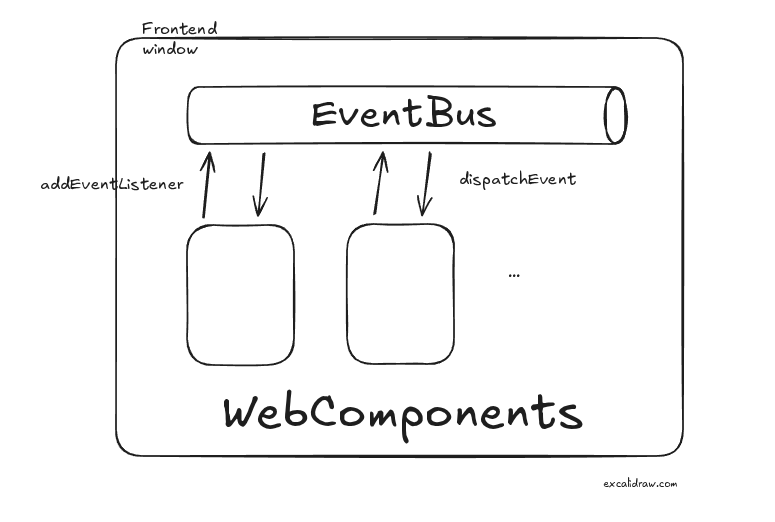
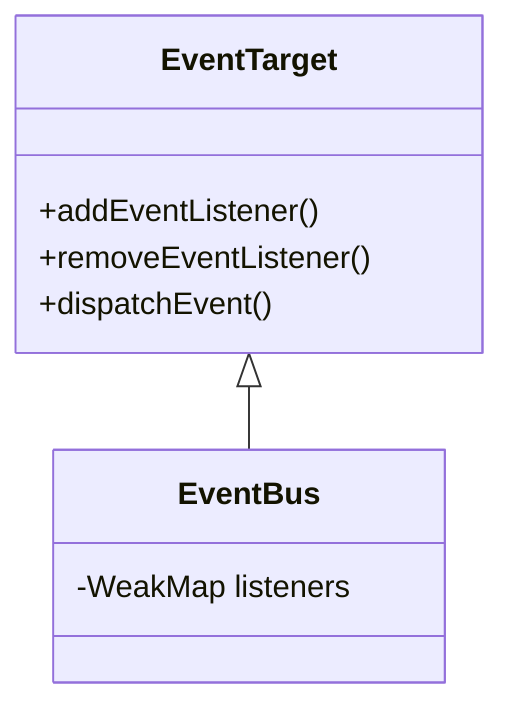

## Getting started

To install the eventbus into your project, simply run

```bash
npm install @yhwh-script/event-bux
```

## How-To

For instance: 

```javascript
<script type="module">
  import * as bus from '@yhwh-script/event-bux';
  window.bus = bus;
</script>
```

After importing `@yhwh-script/event-bux`, it is recommended to add it to the `window` object.

Feel free to import at your own or stick to `@yhwh-script` examples.

Then use `bus.addEventListener(type, listener)` and `bus.dispatchEvent(event)` in your WebComponents. You are not bound to event bubbling or capturing, which are the standard event propagation mechanisms, but now you can send events even among any objects!

```javascript
bus.addEventListener("click", () => {console.log("click")}, window);
bus.dispatchEvent(new Event("click"), window);
```

## EventBus architecture





That's it. Check it out! KISS

## Contribute

Welcome, please give your warm feedback.